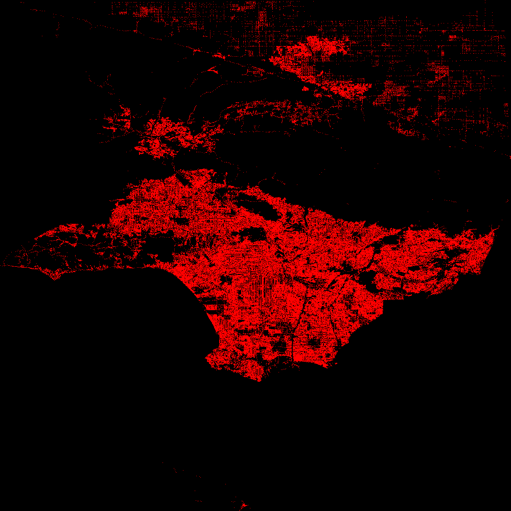

# rapture

rapture is a tool for visualizing large point datasets as rasters. This tool is inspired by datashader, rasterly, and similar tooling.


The example below is generated by calling:
```
rapture -i="path/to/example.geojson" -w=1000 -h=1000 -o="docs/pts.png"
```

