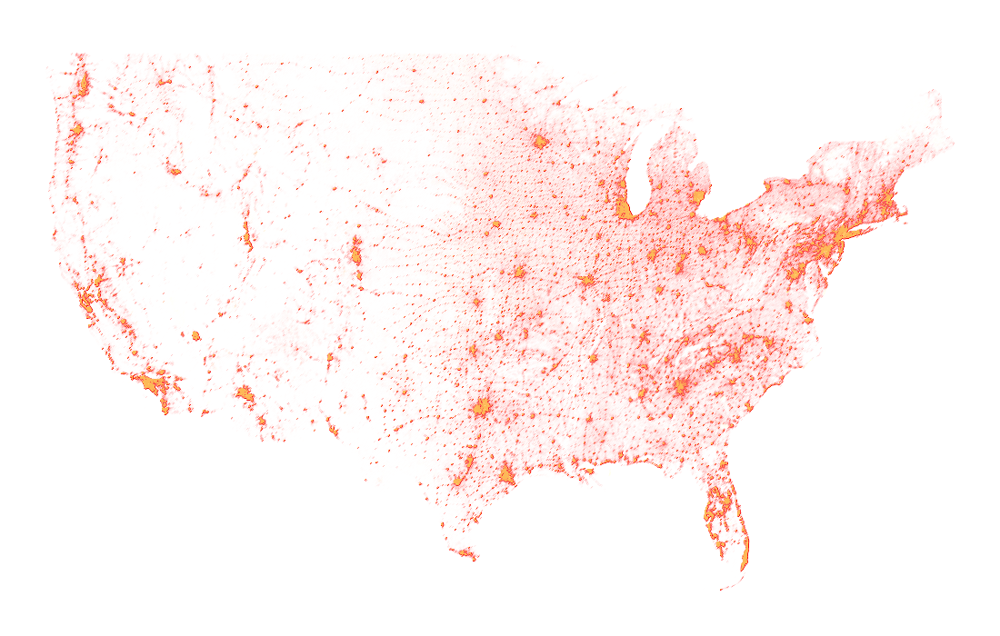

# rapture

> **Warning**: this tool's development is extremely volatile. It is not currently recommended for use.

rapture is a tool for visualizing large point datasets as rasters. This tool is inspired by datashader, rasterly, and similar tooling.


The example below is generated by calling:
```
rapture -i="path/to/example.geojson" -p="POPULATION_2020" -w=1000 -h=600 -padding=100 -o="docs/pts.png""
```



## Roadmap

- Visualization
    - Geometry
        - [ ] Lines
        - [ ] Polygons
    - [ ] Basemaps
    - [X] Color Ramps
    - [X] Property Selection (somewhat)
- Statistics
    - [X] Density (somewhat)
    - [ ] Custom Functions
